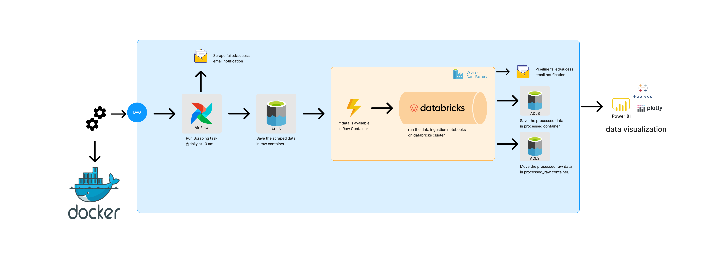
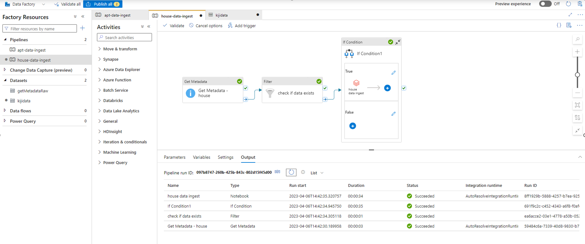
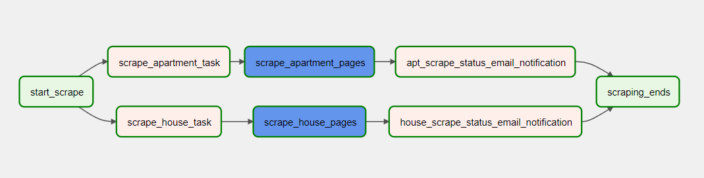
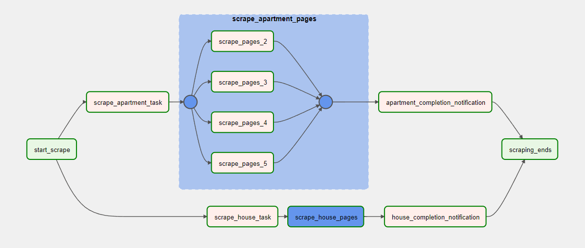
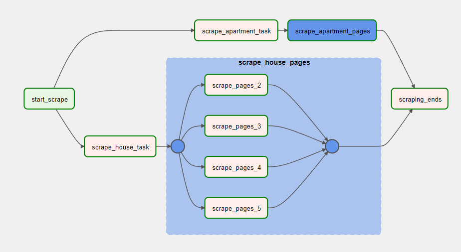

# KIJIJI Scraper

The Kijiji scraper is a web scraper created using BS4 and Python to collect rental properties listed across the Greater Toronto Area (GTA). The data pipeline has been **scheduled** to run **daily at 10 am** using **Apache Airflow**. <br>



+ **Project Architecture**
    + Tools/services used for this project
        + **Airflow** : Schedules the scraper at configured interval : [Config](https://github.com/amald94/kijiji_etl_azure/blob/main/dags/kijiji_scraper.py "Heading link")
        + **Azure Data Lake** : Used to store both raw and processed data.
        + **Azure Databricks** : Used to process the raw data.
        + **Azure Data Factory** : Used to schedule a daily trigger at 10 pm to run notebooks in Databricks once files are available in the Data Lake. 
        + **Docker** : Used to run airflow in Windows machine

+ **Data Collection**
    + Schedule an airflow dag to run daily at 10 am to collect the listings
    + Since we have access to only the first 100 pages on Kijiji, I decided to split the task into 20-page chunks to run them in parallel using **Airflow**.
    + Collect rental listings posted accross GTA
    + Send email **notification** upon task failure/completion
    + Upload the scraped data to **Azure data lake**
 + **Data ingestion**
    + Load the data from **Azure Data Lake** using Spark on **Azure Databricks**
    + Performing transformations and cleaning on the data
    + Save the processed data to container processed in **Azure Data Lake**
    + Move the processed data to container processed_raw in **Azure Data Lake**
 + **Schedule the data pipeline**
    + Schedule the pipeline using **Azure data factory** to run daily at 10pm
    + Run the data ingestion notbooks on **databricks cluster**
    + Send email **notification** upon activity failure/completion
 + **Analyze the data using Spark**
    + link to notebook : [notebook](https://github.com/amald94/kijiji_etl_azure/tree/main/notebooks)
    + Identify the cities with the highest number of listings?
    + Which are the top 5 cities with the highest average rent?
    + Average rent for each city
    + Which city has the most affordable 1 BHK apartment for rent?
    + Identify the most affordable rental option?

## Data pipeline in ADF



# overall DAG


# Apt/condo scraper


# House scraper


## Tech Stack

Kijiji Scraper Architecture uses a number of technologies/services to work properly:

- Docker
- Apache Airflow
- Python
- Spark
- Azure Data Lake
- Azure Databricks
- Azure Data Factory

#### Start Airflow

if you are running first time, initialize the database and create the default user account
```sh
docker-compose up airflow-init
```

Start the airflow container in detached mode using docker-compose.

```sh
docker-compose up -d
```

this will start the airflow webserver and scheduler. We can access the airflow web interface at port 8080

```sh
http://localhost:8080/
```

## Docker file

We have to set few changes in the docker-compose.yaml file
change the executor to LocalExecutor
```sh
AIRFLOW__CORE__EXECUTOR: LocalExecutor
```
There are a couple of ways to add python library dependencies for your project, so keep things simple, list the required lib names as below
```sh
_PIP_ADDITIONAL_REQUIREMENTS: ${_PIP_ADDITIONAL_REQUIREMENTS:- openpyxl}
```
if you want to copy the data from container to local machine , mount a folder with proper write permissions.
```sh
volumes:
    - C:/Users/{}/docker_share/data:/path/to/container/folder
```
> Note: within the code you can aceess the external folder by the path we added - `/path/to/container/folder`

create a network connection to access internet from docker container and add that network name to the docker-compose file
```sh
networks:
  default:
    external: true
    name: "airflow-network"
```
> Note: to create a docker network - `docker network create airflow-network` <br>
> Note: double check if the network has been created - `docker network ls`

Setup smtp for mailing 
https://noted.lol/setup-gmail-smtp-sending-2023/
