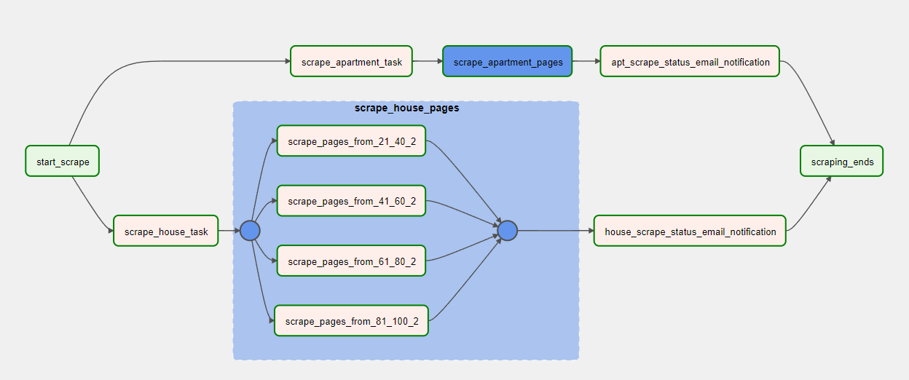

# KIJIJI Scraper

Kijiji scraper is a web scraper created using BS4, python to collect rental properties listed accross GTA. The data pipeline has been scheduled to run daily at 10 am using Apache Airflow. <br>
- We have access to first 100 pages on kijiji and I decided to do the task by splitting by 20 pages for each task to run them in parallel.
- Collect rental properties
- Send email notification upon task failure/completion
- Upload the scraped data to Azure data lake
- Process the data using spark using Azure Databricks
- Save the processed data back to Azure Data Lake
+ Analyze the data
    + Identify the cities with the highest number of listings?
    + Which are the top 5 cities with the highest average rent?
    + Average rent for each city
    + Which city has the most affordable 1 BHK apartment for rent?
    + Identify the most affordable rental option?

# overall DAG

# Apt/condo scraper

# House scraper


## Tech Stack

Kijiji Scraper Architecture uses a number of technologies/services to work properly:

- Docker
- Apache Airflow
- Python
- Spark
- Azure Data Lake
- Azure Databricks
- Azure Data Factory

#### Start Airflow

if you are running first time, initialize the database and create the default user account
```sh
docker-compose up airflow-init
```

Start the airflow container in detached mode using docker-compose.

```sh
docker-compose up -d
```

this will start the airflow webserver and scheduler. We can access the airflow web interface at port 8080

```sh
http://localhost:8080/
```

## Docker file

We have to set few changes in the docker-compose.yaml file
change the executor to LocalExecutor
```sh
AIRFLOW__CORE__EXECUTOR: LocalExecutor
```
There are a couple of ways to add python library dependencies for your project, so keep things simple, list the required lib names as below
```sh
_PIP_ADDITIONAL_REQUIREMENTS: ${_PIP_ADDITIONAL_REQUIREMENTS:- openpyxl}
```
if you want to copy the data from container to local machine , mount a folder with proper write permissions.
```sh
volumes:
    - C:/Users/{}/docker_share/data:/path/to/container/folder
```
> Note: within the code you can aceess the external folder by the path we added - `/path/to/container/folder`

create a network connection to access internet from docker container and add that network name to the docker-compose file
```sh
networks:
  default:
    external: true
    name: "airflow-network"
```
> Note: to create a docker network - `docker network create airflow-network` <br>
> Note: double check if the network has been created - `docker network ls`

Setup smtp for mailing 
https://noted.lol/setup-gmail-smtp-sending-2023/
