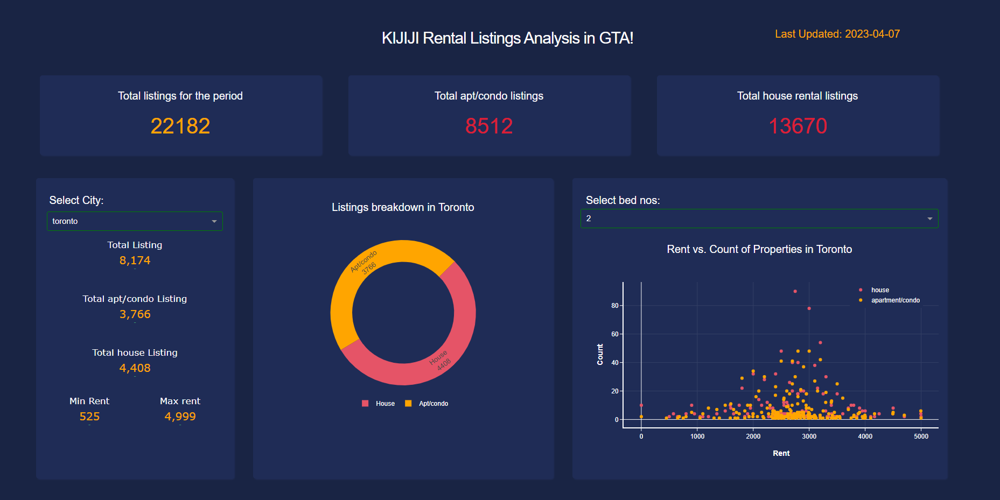

Install the required python packages
```sh
pip install -r requirements.txt
```

Start the server by running
```sh
python index.py
```
Dashboard design inspired from : [url](https://github.com/Mubeen31/Covid-19-Dashboard-in-Python-by-Plotly-Dash)
